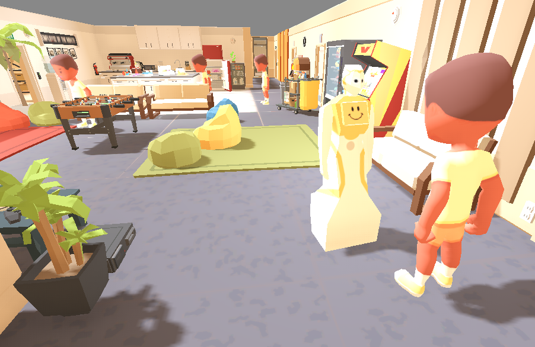
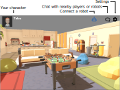
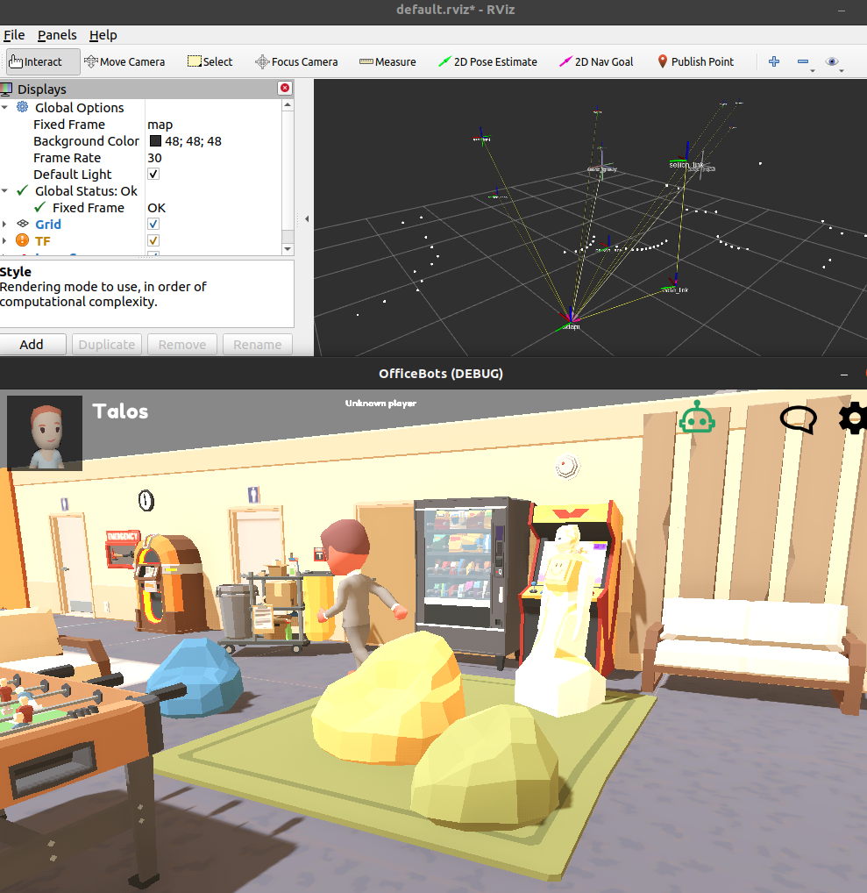

OfficeBots
==========

OfficeBots is an immersive multi-player online game, mainly designed to support
research and teaching in human-robot interaction.

Players can connect to the online server and join an office-like environment
where they can chat and iteract with the surrounding objects.

Simulteanously, robots can be instanciated and remotely controled with a simple
Websocket-based API. Python bindings are provided.

The game is develop with the [Godot 3.5](https://godotengine.org) game engine. You need it to edit the game.

Getting started
---------------

- download the latest release for the [Releases
  page](https://github.com/severin-lemaignan/officebots/releases). Currently,
  **binaries are only provided for Linux 64bits**. See below for other platforms/web-based game
- execute the game by simply double-clicking on the executable. The game is
  fully self contained: you can 'install' it by simply copying it to any
  location you like.

### Single player mode

At launch, select *Single player*. Enter the name of your character and select
one avatar.

You can control your character with arrow keys and the mouse. To pick up an
object, click on the object. Releasing the button drops the object.

You can open doors by clicking on their handles.

The chat window can be used to talk to people or robots close to you. Other
players will see a speech bubble above your head with your message.

#### Adding computer-controller 'NPC' characters

To experiment with human detection and interaction, you can add non-playing
characters (NPCs) to the game, from the *Settings* page. These NPCs are
currently very basic: they simply follow a predefined path in the game, and you
can not interact with them.

#### Spawning a robot in the simulation

You need first to install the OfficeBots Python bindings with eg `pip3 install
officebot`. See the [python-officebots
project](https://github.com/severin-lemaignan/python-officebots/) for details.

Once installed, you can either write simple Python script using `from officebots
import Robot` and subclassing the `Robot` class. See the `python-officebots`
repo for examples.

Alternatively, you can use the provided ROS bridge.

When you start your script (or ROS bridge), you will be ask to connect the
simulator by clicking the blue robot icon at the top of the game screen. Click
it, and your robot should appear.

#### ROS bridge

By starting the `officebots-ros` script (available in your system once you have
installed the Python bindings above), you can interact with the robot in your
simulation.

Currently supported:

- [ROS4HRI](wiki.ros.org/hri)-compatible support for persons, faces, speech
- laserscan publication (standard ROS mapping is possible)

Other platforms, Web version
----------------------------

Godot is a cross-platform game engine: all major operating systems, as well as
web-based HTML5, are supported. To run the game on your platform of choice, open
`project.godot` in [Godot 3.5](https://godotengine.org) (attention! The game has
not been ported to Godot 4: it will **not** work with Godot 4), and follow Godot
documentation to export to game to the desired platform.

