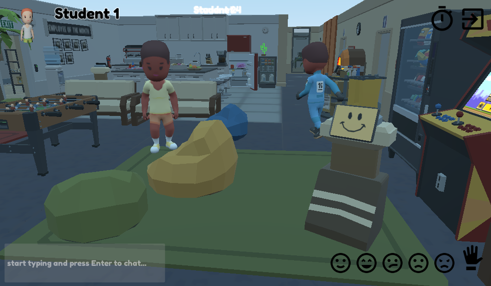

OfficeBots
==========

OfficeBots is an immersive multi-player online game, mainly designed to support
research and teaching in human-robot interaction.

Players can connect to the online server and join an office-like environment
where they can chat and iteract with the surrounding objects.

Simulteanously, robots can be instanciated and remotely controled with a simple
Websocket-based API. Python bindings are provided.

The game is develop with the [Godot 3.2](https://godotengine.org) game engine. You need it to edit the game.

